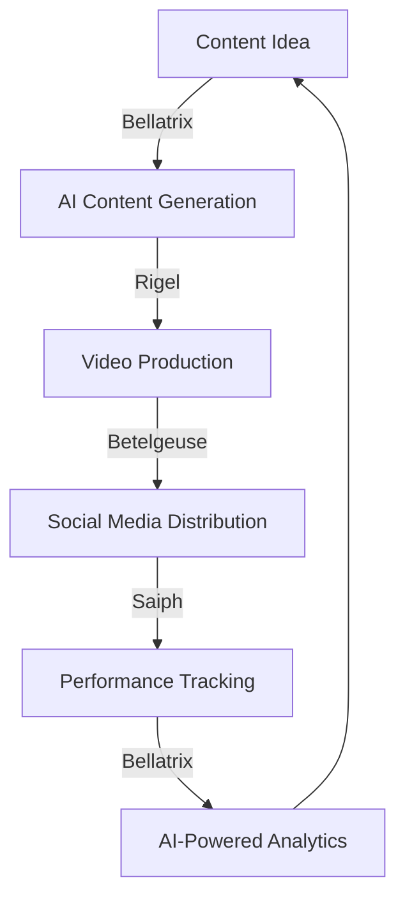

# Module Overview

Nebula Orion is organized into four core modules, each named after a star in the Orion constellation. This modular architecture allows you to use only the components you need while maintaining a cohesive overall system.

## Architecture Philosophy

The Orion library follows a stellar-inspired architecture where each module represents a distinct area of functionality while maintaining the ability to interact seamlessly with other components.

<div class="module-card">
  <h2><span class="emoji-icon">🔴</span> Betelgeuse</h2>
  <p><strong>Focus:</strong> Social Media Management</p>
  <p>Like its namesake red supergiant star, Betelgeuse is the most visible module in Orion, handling all your social media presence needs. It manages content scheduling, audience engagement, analytics tracking, and multi-platform coordination.</p>
  <p><a href="betelgeuse/" class="md-button">Betelgeuse Documentation</a></p>
</div>

<div class="module-card">
  <h2><span class="emoji-icon">🤖</span> Bellatrix</h2>
  <p><strong>Focus:</strong> AI & Machine Learning</p>
  <p>Named after the "warrior star" in Orion, Bellatrix equips your applications with powerful AI capabilities, from content analysis and generation to predictive modeling and optimization algorithms.</p>
  <p><a href="bellatrix/" class="md-button">Bellatrix Documentation</a></p>
</div>

<div class="module-card">
  <h2><span class="emoji-icon">🎥</span> Rigel</h2>
  <p><strong>Focus:</strong> Video Production Pipeline</p>
  <p>Drawing inspiration from the bright blue Rigel star, this module illuminates your video workflow with automated processing tools, render farm management, and asset organization systems.</p>
  <p><a href="rigel/" class="md-button">Rigel Documentation</a></p>
</div>

<div class="module-card">
  <h2><span class="emoji-icon">⚙️</span> Saiph</h2>
  <p><strong>Focus:</strong> Automation Systems</p>
  <p>Like the organized star in Orion's "belt," Saiph provides structure to your operations through project tracking, resource allocation, workflow automation, and system integration.</p>
  <p><a href="saiph/" class="md-button">Saiph Documentation</a></p>
</div>

## Module Independence & Integration

Each module can function independently with minimal dependencies, allowing you to use only what you need. However, the true power of Nebula Orion emerges when multiple modules work together:



## Getting Started with Modules

Each module follows a consistent pattern for ease of use:

1. Import the module
2. Initialize the main controller class
3. Use the provided methods to accomplish your tasks

Here's a basic example using the Betelgeuse module:

```python
from nebula_orion import betelgeuse

# Initialize the module
social = betelgeuse.SocialMediaManager()

# Use the module's functionality
social.schedule_post(
    content="Excited to announce our latest feature!",
    platforms=["twitter", "instagram"],
    schedule_time="2024-04-15T14:30:00"
)
```

## Next Steps

Explore each module in detail:

- [Betelgeuse Documentation](betelgeuse.md)
- [Bellatrix Documentation](bellatrix.md)
- [Rigel Documentation](rigel.md)
- [Saiph Documentation](saiph.md)
